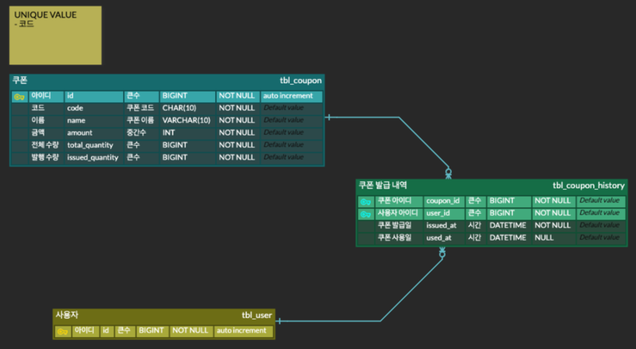

# 2022 당근마켓 WINTERTECH 인턴십
당근페이팀 서버 엔지니어 과제 🥕

<br>

## 1. 개발환경
- Kotlin
- JDK 17
- Gradle (Multi Module)
- JPA, MySQL
- Spring Boot 2.7.5

<br>

## 2. 설치 및 실행 방법
### 다운로드
- Github에 업로드된 프로젝트를 clone 받기 위해 git이 자신의 local에 설치되어 있어야 합니다.
```
$ git clone https://github.com/softpeanut/dangpa_ass.git
```

### 빌드
- Gradle이 자신의 local에 미리 설치되어 있어야 합니다.
```
$ ./gradlew build
```

### 실행
- 아래의 명령어를 실행하기 전에 MySQL Database를 자신의 local에 미리 실행시키고 `CREATE DATABASE igloomall` SQL문을 통해 스키마를 생성합니다.
- application.yml 파일에서 `MYSQL_USERNAME`과 `MYSQL_PASSWORD`, `DB_PORT`를 자신의 Database에 맞게 수정해야 합니다.
```
$ ./gradlew bootRun
```

### 실행 확인
- 자신의 브라우저에 [http://localhost:8080](http://localhost:8080)을 입력하여 `Welcom to Igloo Mall`이라는 문구 보이는지 확인합니다.

<br>

## 3. ERD
ERD는 `erd cloud` 툴을 활용하여 제작하였습니다.



### 기본키 구성
- `tbl_coupon`, `tbl_user`의 PK -> **Auto Increment**
- `tbl_coupon_history`의 PK -> **`tbl_coupon`과 `tbl_user`의 PK를 복합키로 구성**

### 연관 관계
- `tbl_coupon` - `tbl_coupon_history` => 1 to N
- `tbl_user` - `tbl_coupon_history` => 1 to N

### 제약 조건
- `tbl_coupon`의 code(column) -> **unique 제약조건**

<br>

## 4. API 명세서
> API 명세서는 [이곳](https://documenter.getpostman.com/view/18646466/2s8YmSt1yy)에서 확인할 수 있습니다.
> * Postman을 활용하여 가독성이 좋고, 쉽게 테스트할 수 있는 환경이 마련되어 있습니다.
- Example Request 부분에서 SUCCESS 케이스 외에 FAILED 케이스 또한 확인할 수 있습니다.
- curl 명령어를 비롯하여 다양한 언어로 직접 요청을 보내 확인할 수 있습니다. (서버를 실행해야 요청이 가능합니다 😃)

<br>

## 5. Trouble Shooting
과제를 진행하며 마주한 문제들에 대해 기록합니다.

### Flyway 사용 시 빌드가 안 되는 이슈
- 먼저, Flyway를 사용하기 위해 infrastructure module의 `build.gradle`에 `org.flywaydb:flyway-core` 의존성을 추가하였습니다.
- 하지만 `Unsupported Database: MySQL 8.0` 오류 메시지와 함께 빌드가 실패하였습니다.

> 현재 데이터베이스로 MySQL을 사용하고 있습니다. Flyway를 사용해 DB Migration을 진행하기 위해서 해당 **데이터베이스와 관련된 의존성**이 추가로 필요하였습니다.
>
> ➡️ 따라서 `org.flywaydb:flyway-core`가 내장되어 있는 `org.flywaydb:flyway-mysql`으로 변경하여 해결하였습니다.
